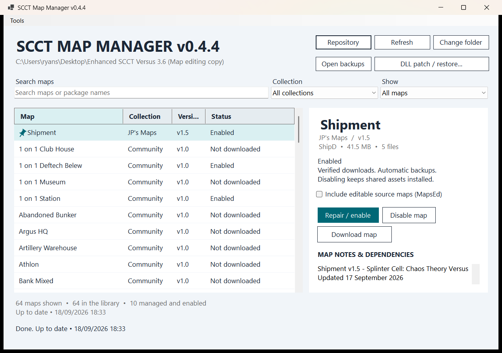

# SCCT Map Manager

Download, enable and update maps for **Splinter Cell: Chaos Theory Versus** from the [SCCT Maps collection](https://github.com/Lumbridge/SCCT-Maps) — no manual file copying.



## Install

1. [Download the latest release](https://github.com/Lumbridge/SCCT-Map-Manager/releases/latest) and extract it.
2. Put **SCCT Map Manager.exe** in your game's `System` folder.
3. Run it from there.

Needs Windows 10/11 (64-bit) and Enhanced SCCT Versus 3.6. To update the manager, close it and replace the EXE.

## Using it

- Pick a map from the list (search or filter by collection) and press **Enable map**. It downloads, verifies and installs the map.
- **Disable map** takes it out of play; enable it again any time.
- **Download map** just saves it for later, or updates an installed map.
- Tick **Include editable source maps** if you also want the editor (`MapsEd`) files.
- **Change folder** switches to another game installation.

Close the game and the editor before enabling, disabling or updating maps. Everyone on a server needs the same map files.

### Textures and static meshes

**Tools → Textures & static meshes** lists optional asset packs for map makers, such as the converted Rainbow Six Vegas meshes. Install or update them like maps. Packs stay installed because maps may depend on them.

### If custom maps crash the game

Try **DLL patch / restore...** in the toolbar. It backs up your current DLL first, and **Restore selected backup** puts it back. It does not fix every crash.

### Backups

Everything the manager downloads, disables or backs up lives in `System/SCCTMapManagerData`; keep that folder. **Open backups** shows it. The manager refuses to overwrite maps you have edited yourself.

## For map publishers

How to publish maps and asset packs so the manager can find them: [docs/publishing.md](docs/publishing.md).

## Build

With the .NET 10 SDK installed:

```powershell
./build.ps1 -Test
```

Output goes to `artifacts/publish`. Add `-LiveTests` to exercise downloads against a disposable installation.
